# Aircraft Accident Tracker

<p align="center">
  
</p>

[](https://n8n.io)
[](https://www.postgresql.org/)
[](https://openai.com)


[](LICENSE)


>### *"Those who cannot remember the past are condemned to repeat it."* — George Santayana

---

## What This Project Does

The Aircraft Accident Tracker is an automated safety intelligence system that tracks incidents and accidents involving Cessna Citation aircraft, although it is easily adapted for any aircraft. It continuously monitors the [Aviation Safety Network (ASN)](https://aviation-safety.net) database, extracting incident data including locations, operators, damage assessments, and full narrative reports. Each incident is then enriched with an AI-generated summary using OpenAI's GPT-5.1 model, which distills lengthy investigation narratives into concise overviews. For fatal and serious accidents as well as aircraft marked as `w/o` (written off), the system also searches Google via SerpAPI to discover related NTSB investigation reports, news coverage, flight tracking data, and photos, automatically categorizing and linking these resources for easy access.

The entire system runs as an n8n workflow with PostgreSQL storage, designed for hands-off operation. A scheduled trigger runs daily at 8 AM (user defined) to collect new incidents and process enrichments, while four additional webhook endpoints allow on-demand execution of specific processing phases. The workflow implements intelligent deduplication using composite keys on aircraft registration and date, hash-based change detection to identify when ASN updates their narratives, and rate limiting to respect external service quotas. All data flows into an interactive HTML dashboard that supports filtering by aircraft type, date range, keywords, and fatality status, with expandable rows showing full incident details alongside categorized resource links.

> **New to n8n?** Check out my [n8n_nginx](https://github.com/rjsears/n8n_nginx) repository for a complete n8n + PostgreSQL + Nginx setup with SSL. You can have a production-ready n8n instance running in about 20 minutes! See the [Quick Start with n8n_nginx](#-quick-start-with-n8n_nginx) section below. 

---

## Table of Contents

- [Features](#-features)
- [System Architecture Overview](#-system-architecture-overview)
- [Trigger Paths – Complete Reference](#-trigger-paths--complete-reference)
  - [Path 1: Daily Scheduled Run (8 AM)](#path-1-daily-scheduled-run-8-am)
  - [Path 2: Manual Run Webhook](#path-2-manual-run-webhook)
  - [Path 3: Deep Refresh Webhook](#path-3-deep-refresh-webhook)
  - [Path 4: Manual SerpAPI Webhook](#path-4-manual-serpapi-webhook)
  - [Path 5: Manual AI Narrative Webhook](#path-5-manual-ai-narrative-webhook)
- [Date-Based Processing Logic](#-date-based-processing-logic)
  - [Smart Detail Fetch Logic](#smart-detail-fetch-logic)
  - [SerpAPI Re-Search Scheduling](#serpapi-re-search-scheduling)
  - [Deep Refresh Window](#deep-refresh-window)
- [Customizing Aircraft Types](#customizing-aircraft-types)
  - [Understanding the Define Config Node](#understanding-the-define-config-node)
  - [The Four Configuration Arrays](#the-four-configuration-arrays)
  - [Why Normalization Rules Exist](#why-normalization-rules-exist)
  - [Step-by-Step: Adding New Aircraft](#step-by-step-adding-new-aircraft)
  - [Step-by-Step: Removing Aircraft](#step-by-step-removing-aircraft)
  - [Complete Example: Cessna Piston Singles](#complete-example-cessna-piston-singles)
- [Quick Start with n8n_nginx](#-quick-start-with-n8n_nginx)
- [Quick Start (Manual)](#quick-start-manual-docker-setup)
- [Detailed Installation](#-detailed-installation)
- [Configuration Guide](#-configuration-guide)
- [Usage & Operations](#-usage--operations)
- [Database Schema](#-database-schema)
- [Troubleshooting](#-troubleshooting)
- [Contributing](#-contributing)
- [License](#-license)

---

## ✨ Features

### Automated Data Collection
- **Multi-aircraft monitoring** — Track multiple Citation models simultaneously (CE525 series, CE500 series, CE560XL series, and Bombardier Challengers)
- **Automatic pagination** — Handles ASN's paginated results, fetching all pages for aircraft types with extensive accident histories
- **Full narrative extraction** — Pulls complete investigation reports from ASN detail pages
- **Smart deduplication** — Composite key prevents duplicate records while allowing updates
- **Change detection** — Hash-based tracking identifies when ASN updates their narratives

### AI-Powered Enrichment
- **GPT-5.1 summaries** — Transforms lengthy narratives into concise 4-6 sentence overviews
- **Factual extraction only** — AI is prompted to use only stated facts, no speculation
- **Batch processing** — Efficiently handles large backlogs with rate limiting

### Intelligent Link Discovery
- **Google Search integration** — Finds NTSB reports, news articles, videos, and photos
- **Quality filtering** — Whitelist/blacklist system ensures relevant, trusted sources
- **Auto-categorization** — Links tagged by type (NTSB, FAA, News, Video, Photo)
- **Auto-generated FAA links** — Registry lookup links added for all N-number aircraft

### Interactive Dashboard
- **Multiple filter options** — Aircraft type, registration, date range, keywords, fatal-only
- **Live statistics** — Total incidents, fatal count, total fatalities, recent incidents
- **Expandable details** — Click any row for full incident information
- **Side-by-side layout** — Aircraft details paired with AI summary and resource links

### Operational Flexibility
- **Scheduled automation** — Daily runs at 8 AM with no intervention needed
- **Webhook triggers** — Five endpoints for targeted on-demand processing
- **Deep refresh** — Re-check ASN for updated narratives on recent incidents
- **Graceful handling** — Empty batches and API errors handled without workflow failures

---

## System Architecture Overview

The workflow is built around a centralized configuration architecture with intelligent routing that directs each trigger to its appropriate processing path.

### Master Workflow Architecture

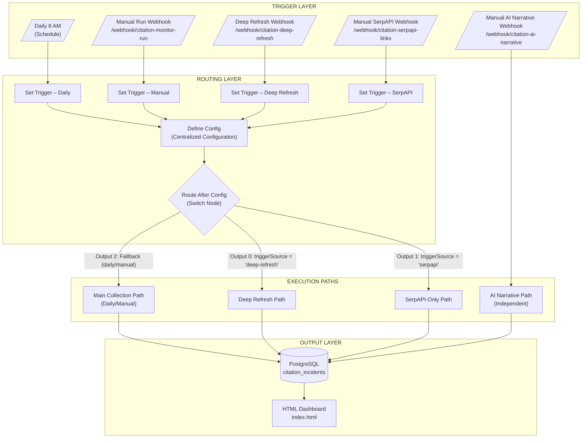

### Key Design Principles

| Principle | Implementation |
|-----------|----------------|
| **Centralized Configuration** | All aircraft types, link filters, and HTML settings defined in single `Define Config` node |
| **Trigger Source Routing** | `Route After Config` switch node directs flow based on `triggerSource` value |
| **Data Preservation** | Never delete records—once in database, always preserved (even if removed from ASN) |
| **Change Detection** | Hash-based tracking identifies when ASN updates narratives |
| **Rate Limiting** | Conservative throttling protects against API quota exhaustion |
| **Smart Refresh** | Age-based logic minimizes unnecessary requests while maintaining data freshness |

---

## Trigger Paths – Complete Reference

The workflow has **5 distinct entry points**, each designed for a specific purpose. Understanding these paths is critical for effective operation and troubleshooting.

### Trigger Path Summary

| # | Trigger | Endpoint | Purpose | Routes Through Config? |
|---|---------|----------|---------|:----------------------:|
| 1 | Daily 8 AM | Schedule | Full automated daily collection |          Yes           |
| 2 | Manual Run | `POST /webhook/citation-monitor-run` | On-demand full collection |          Yes           |
| 3 | Deep Refresh | `POST /webhook/citation-deep-refresh` | Re-check ASN for narrative updates |          Yes           |
| 4 | Manual SerpAPI | `POST /webhook/citation-serpapi-links` | Enrich incidents with Google links |          Yes           |
| 5 | Manual AI | `POST /webhook/citation-ai-narrative` | Process AI summaries only |    No (Independent)    |

### How Routing Works

Four of the five triggers flow through the same configuration and routing layer. The routing decision is made by the `Route After Config` switch node based on the `triggerSource` value set by each trigger:

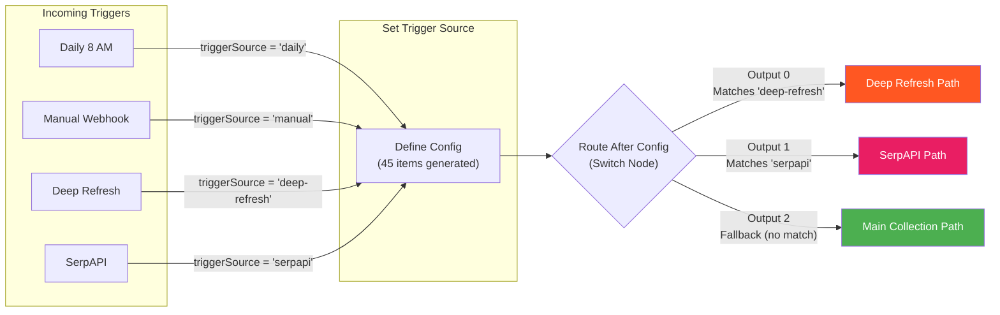

**Important**: The Manual AI Narrative webhook bypasses this entire routing layer and directly starts its own independent processing path.

---

### Path 1: Daily Scheduled Run (8 AM)

**Purpose**: Complete automated data collection with full AI and link enrichment.

**Trigger**: Schedule trigger fires at 8:00 AM daily (configurable timezone)

**What happens**:
1. Sets `triggerSource = 'daily'` 
2. Generates configuration (45 ASN URLs: 15 aircraft types × 3 pages each)
3. Routes to Main Collection Path (fallback output)
4. Fetches all ASN type pages, parses incident tables
5. Queries database for existing records
6. Uses Smart Detail Fetch to determine which incidents need detail page fetching
7. Fetches ASN detail pages for qualifying incidents (rate limited: 5 per 2 seconds)
8. Extracts narratives and ASN source links
9. Upserts all incidents to database (preserving existing AI summaries and Google links)
10. Generates initial HTML dashboard
11. Processes AI summaries for incidents with narratives but no summary
12. Enriches fatal/substantial incidents with Google links (up to configured limit)
13. Regenerates final HTML dashboard

```mermaid
flowchart TB
    subgraph TRIGGER["TRIGGER"]
        T1[/"Daily 8 AM<br/>(Schedule Trigger)"/]
    end

    subgraph CONFIG["CONFIGURATION"]
        ST["Set Trigger – Daily<br/>triggerSource = 'daily'"]
        DC["Define Config<br/>(Generates 45 items:<br/>15 aircraft types × 3 pages)"]
        RAC{"Route After Config"}
    end

    subgraph COLLECTION["DATA COLLECTION PHASE"]
        FETCH["Fetch ASN Page<br/>(45 parallel requests)"]
        PARSE["Parse ASN Table<br/>(Normalize aircraft types)"]
        AGG["Aggregate Before DB Query"]
        QER["Query Existing Records<br/>(Get current DB state)"]
        FILTER["Filter Detail Fetch Candidates<br/>Smart age-based filtering"]
        DETAIL["Fetch Detail Pages<br/>(Rate limited: 5 per 2 sec)"]
        EXTRACT["Extract ASN Sources<br/>(Narratives + links + hash)"]
        MERGE["Merge All Results"]
        FLAT["Flatten Results<br/>(Strip additional_links<br/>to preserve Google links)"]
    end

    subgraph DATABASE["DATABASE PHASE"]
        UPSERT["Upsert Incidents<br/>(Key: registration + date_string)"]
        CONS["Consolidate Before Query"]
        QAI["Query All Incidents"]
    end

    subgraph HTML1["INITIAL HTML"]
        GEN1["Generate HTML"]
        WRITE1["Write HTML File"]
    end

    subgraph NARRATIVE["AI NARRATIVE PHASE"]
        FN["Filter For Narrative<br/>(Has raw_narrative > 50 chars<br/>but no narrative_summary)"]
        CNS{"Check Narrative Skip"}
        WN["Wait for Narrative"]
        FASN["Fetch ASN Detail Page<br/>(Re-fetch for AI context)"]
        ENT["Extract Narrative Text"]
        ASE["Aviation Safety Expert<br/>(GPT-4o Agent)"]
        PAR["Parse AI Response"]
        UND["Update Narrative in DB<br/>(Merges ASN links)"]
    end

    subgraph ENRICHMENT["LINK ENRICHMENT PHASE"]
        FE["Filter For Enrichment<br/>(Fatal/destroyed/substantial,<br/>no Google-sourced links)"]
        CIS{"Check If Skip"}
        WE["Wait for Enrichment"]
        SGL["Search Google Links<br/>(SerpAPI, rate limited)"]
        PSR["Parse Search Results<br/>(Filter + categorize)"]
        ULD["Update Links in DB"]
    end

    subgraph FINAL["FINAL OUTPUT"]
        QFD["Query Final Data"]
        RH["Regenerate HTML"]
        WFH["Write Final HTML"]
    end

    T1 --> ST
    ST --> DC
    DC --> RAC
    RAC -->|"Output 2 (Fallback)"| FETCH
    
    FETCH --> PARSE
    PARSE --> AGG
    AGG --> QER
    QER --> FILTER
    FILTER --> DETAIL
    DETAIL --> EXTRACT
    EXTRACT --> MERGE
    MERGE --> FLAT
    FLAT --> UPSERT
    
    UPSERT --> CONS
    CONS --> QAI
    QAI --> GEN1
    GEN1 --> WRITE1
    
    WRITE1 --> FN
    FN --> CNS
    CNS -->|"skip = true<br/>(No incidents need AI)"| WN
    CNS -->|"skip = false<br/>(Incidents need processing)"| FASN
    FASN --> ENT
    ENT --> ASE
    ASE --> PAR
    PAR --> UND
    UND --> WN
    
    WN --> FE
    FE --> CIS
    CIS -->|"skip = true<br/>(No incidents need links)"| WE
    CIS -->|"skip = false<br/>(Incidents need enrichment)"| SGL
    SGL --> PSR
    PSR --> ULD
    ULD --> WE
    
    WE --> QFD
    QFD --> RH
    RH --> WFH

    style T1 fill:#4CAF50,color:#fff
    style DC fill:#2196F3,color:#fff
    style FILTER fill:#FF9800,color:#fff
    style ASE fill:#9C27B0,color:#fff
    style SGL fill:#E91E63,color:#fff
    style WFH fill:#00BCD4,color:#fff
```

#### Key Processing Notes

| Node | Critical Function |
|------|-------------------|
| **Define Config** | Generates 45 items (15 aircraft × 3 pages), each containing full configuration |
| **Parse ASN Table** | Normalizes aircraft types using config rules (e.g., CJ4 on C525 page → C25C) |
| **Filter Detail Fetch Candidates** | Implements smart age-based filtering to minimize ASN requests (see [Smart Detail Fetch Logic](#smart-detail-fetch-logic)) |
| **Flatten Results** | **Critical**: Strips `additional_links` field to prevent overwriting existing Google links during upsert |
| **Filter For Narrative** | Finds incidents with `raw_narrative` > 50 chars but no `narrative_summary` |
| **Filter For Enrichment** | Finds fatal/destroyed/substantial incidents without `google_search` sourced links |

---

### Path 2: Manual Run Webhook

**Purpose**: On-demand full data collection (identical processing to Daily run)

**Endpoint**: `POST /webhook/citation-monitor-run`

**When to use**: 
- Testing workflow changes
- Force immediate collection after ASN updates
- Initial data population
- After making configuration changes

```bash
curl -X POST https://your-domain.com/webhook/citation-monitor-run
```

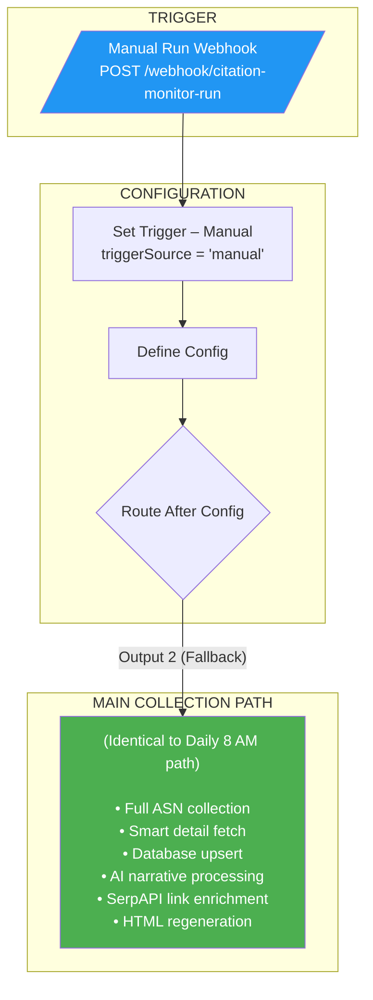

**The Manual Run webhook follows the exact same processing path as the Daily 8 AM trigger.** Both set different `triggerSource` values (`'manual'` vs `'daily'`), but `Route After Config` treats both as fallback (Output 2) since neither matches `'deep-refresh'` or `'serpapi'`.

---

### Path 3: Deep Refresh Webhook

**Purpose**: Re-check ASN for updated narratives on recent incidents without full collection

**Endpoint**: `POST /webhook/citation-deep-refresh`

**When to use**:
- After major incident investigation updates are expected
- Periodic re-validation of recent incident data
- When you suspect ASN has added new information to existing incidents
- After NTSB releases final reports

```bash
curl -X POST https://your-domain.com/webhook/citation-deep-refresh
```

**How it works**: This path fetches only the ASN detail pages for incidents from the last 12 months, computes a hash of the current narrative, and compares it to the stored hash. If changed, the incident is updated and its AI summary is cleared (forcing regeneration on the next AI run).

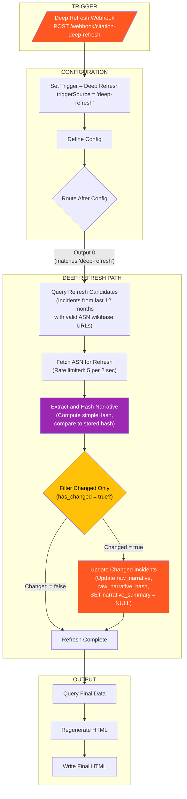

#### Hash-Based Change Detection Explained

The workflow uses a simple deterministic hash function to detect when ASN has updated an incident's narrative:

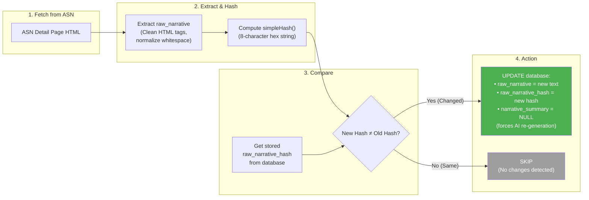

#### Why 12 Months?

The deep refresh only queries incidents from the last 12 months because:

1. **Investigation Timeline**: NTSB preliminary reports are typically published within days/weeks, with final reports completed within 12-18 months
2. **Diminishing Returns**: Incidents older than 12 months rarely receive narrative updates
3. **Resource Efficiency**: Limiting scope reduces ASN server load and processing time
4. **Data Integrity**: Older incidents have stable, complete narratives

See [Deep Refresh Window](#deep-refresh-window) for full rationale.

---

### Path 4: Manual SerpAPI Webhook

**Purpose**: Enrich incidents with Google search links without performing full collection

**Endpoint**: `POST /webhook/citation-serpapi-links`

**When to use**:
- Process backlog of incidents needing Google links
- After increasing SerpAPI quota
- Targeted link enrichment without collection overhead
- When new NTSB reports are expected to be available

```bash
curl -X POST https://your-domain.com/webhook/citation-serpapi-links
```

**How it works**: This path queries the database directly for incidents that meet enrichment criteria (fatal, destroyed, or substantial damage) and haven't been searched recently, then performs Google searches via SerpAPI.

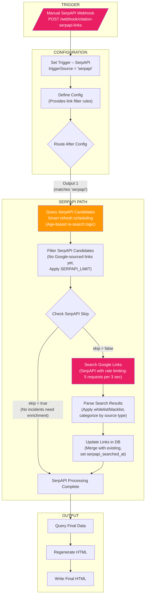

#### SerpAPI Candidate Selection

The `Query SerpAPI Candidates` node uses sophisticated SQL to select incidents based on age and last search time. See [SerpAPI Re-Search Scheduling](#serpapi-re-search-scheduling) for the complete logic and rationale.

---

### Path 5: Manual AI Narrative Webhook

**Purpose**: Process AI summaries for incidents that have narratives but no AI-generated summary

**Endpoint**: `POST /webhook/citation-ai-narrative`

**When to use**:
- Process backlog of AI summaries after bulk data import
- After deep refresh clears narrative summaries for updated incidents
- Testing AI prompt changes
- Rate-limited catch-up after API quota reset

```bash
curl -X POST https://your-domain.com/webhook/citation-ai-narrative
```

> ⚠️ **Important**: This is the only trigger that does **NOT** flow through `Define Config` or `Route After Config`. It operates as a completely independent path, directly querying the database and processing AI summaries.

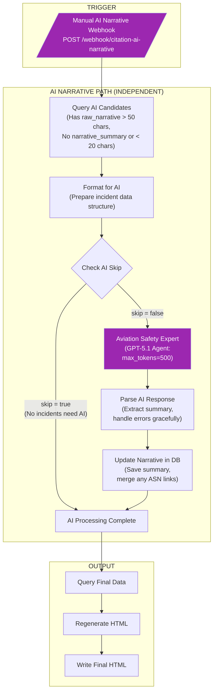

#### AI Processing Details

The **Aviation Safety Expert** agent uses GPT-5.1 with carefully tuned parameters:

| Parameter | Value   | Rationale |
|-----------|---------|-----------|
| Temperature | 0       | Deterministic output for consistency |
| Max Tokens | 500     | Sufficient for 4-6 sentence summary |
| Model | GPT-5.1 | Best balance of quality and cost |

**System prompt enforces**:
- Use only facts explicitly stated in narrative
- No speculation, inference, or assumptions
- 4-6 sentence minimum paragraph
- Imperial units only (convert any metric measurements)
- Must end with aircraft status and casualties (if known)

---

## Date-Based Processing Logic

The workflow uses several date-based algorithms to optimize processing efficiency while maintaining data freshness. Understanding these is essential for effective operation.

### Smart Detail Fetch Logic

**Location**: `Filter Detail Fetch Candidates` node in Main Collection Path

**Purpose**: Minimize unnecessary ASN detail page fetches by skipping incidents that were recently updated

The logic evaluates each incident's age and last update time to determine if fetching the detail page is worthwhile:

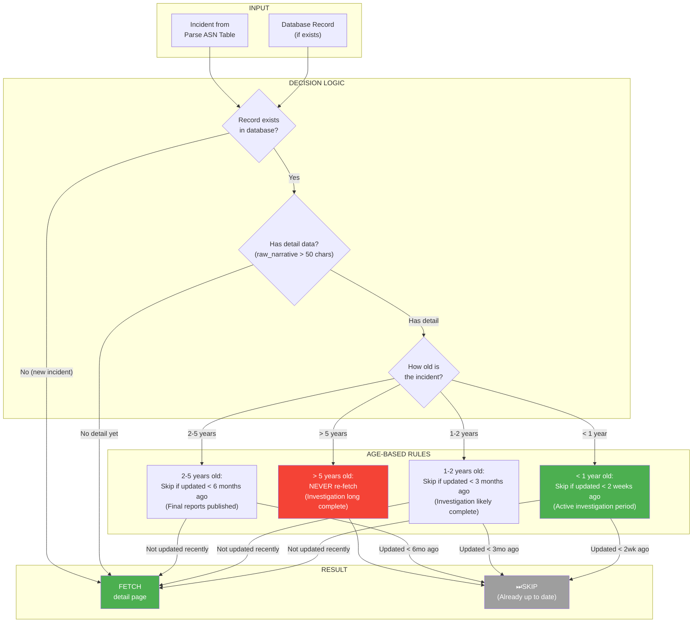

#### Complete Rationale Table

| Incident Age | Skip If Updated Within | Why This Window? |
|--------------|------------------------|------------------|
| **> 5 years** | Always skip | Investigation concluded years ago. ASN pages for these incidents are essentially static. Re-fetching wastes resources and adds load to ASN servers with zero expected benefit. |
| **2-5 years** | 6 months | Final NTSB reports are published. Any corrections are rare and minor. 6-month window provides reasonable check-in while avoiding unnecessary traffic. |
| **1-2 years** | 3 months | Investigation typically concluding. Final reports being released. More frequent checks capture these updates without being excessive. |
| **< 1 year** | 2 weeks | Active investigation period. Preliminary reports, updates, and corrections are common. Frequent checks ensure we capture the evolving information. |

---

### SerpAPI Re-Search Scheduling

**Location**: `Query SerpAPI Candidates` SQL in SerpAPI Path

**Purpose**: Periodically re-search Google for incidents because new resources (NTSB final reports, news articles, videos) become available over time

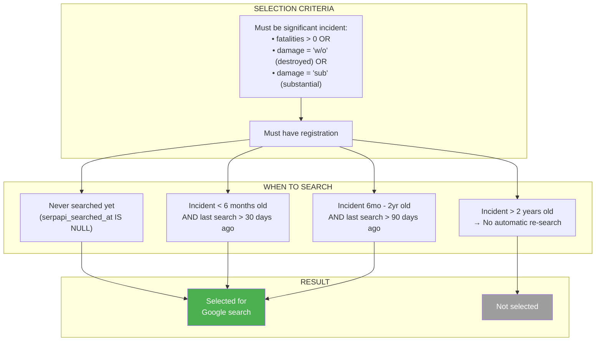

#### SQL Implementation

```sql
SELECT * FROM citation_incidents 
WHERE (fatalities > 0 OR damage = 'w/o' OR damage = 'sub')
  AND registration IS NOT NULL
  AND (
    -- Never been searched
    serpapi_searched_at IS NULL
    
    OR (
      -- Recent incidents (< 6 months): re-search every 30 days
      incident_date > CURRENT_DATE - INTERVAL '6 months'
      AND serpapi_searched_at < NOW() - INTERVAL '30 days'
    )
    
    OR (
      -- Older incidents (6 months - 2 years): re-search every 90 days
      incident_date BETWEEN CURRENT_DATE - INTERVAL '2 years' 
                        AND CURRENT_DATE - INTERVAL '6 months'
      AND serpapi_searched_at < NOW() - INTERVAL '90 days'
    )
    -- Incidents > 2 years old are NOT automatically re-searched
  )
ORDER BY incident_date DESC;
```

#### Rationale for Re-Search Windows

| Incident Age | Re-search Frequency | Why? |
|--------------|---------------------|------|
| **< 6 months** | Every 30 days | Active news cycle. Preliminary NTSB reports published. News coverage ongoing. New videos/photos may surface. |
| **6 months - 2 years** | Every 90 days | NTSB final reports typically released in this window (12-18 months average). Worth periodic checks but less urgency. |
| **> 2 years** | Never (automatic) | Investigation complete. Final reports published. News cycle concluded. Manual trigger can still search if needed. |

**Note**: Incidents older than 2 years can still be searched using the Manual SerpAPI webhook—they're just not automatically selected for re-search.

---

### Deep Refresh Window

**Location**: `Query Refresh Candidates` SQL in Deep Refresh Path

**Purpose**: Limit narrative change detection to incidents where updates are actually expected

```sql
SELECT * FROM citation_incidents
WHERE source_url LIKE '%wikibase/%'
  AND incident_date IS NOT NULL
  AND to_date(incident_date, 'YYYY-MM-DD') >= (CURRENT_DATE - INTERVAL '12 months')
ORDER BY incident_date DESC;
```

#### Why 12 Months?

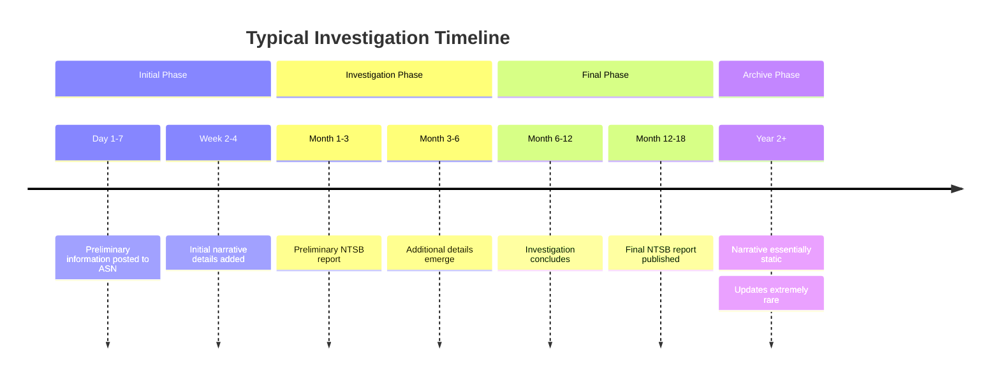

| Time Period | Expected Updates | Refresh Value |
|-------------|------------------|---------------|
| **0-6 months** | High frequency | High value |
| **6-12 months** | Moderate frequency | Moderate value |
| **1-2 years** | Occasional final reports | Diminishing value |
| **> 2 years** | Extremely rare | Negligible value |

By focusing on the last 12 months, the deep refresh:
- Captures most investigation updates
- Minimizes unnecessary ASN requests
- Reduces workflow execution time
- Maintains data accuracy where it matters most

---

## Customizing Aircraft Types

This workflow can be adapted to monitor any aircraft type available on the Aviation Safety Network. This section provides complete instructions for adding, removing, or completely replacing the monitored aircraft types.

### Understanding the Define Config Node

All aircraft configuration is centralized in the **Define Config** node. This node is a Code node that outputs configuration items used throughout the workflow. When you need to change which aircraft are monitored, this is the only node you need to modify.

The node generates multiple output items (one per ASN page URL to fetch), but each item contains the complete configuration for the entire workflow. Downstream nodes access configuration using:

```javascript
// Get configuration from Define Config
const config = $('Define Config').first().json;
const normalizationRules = config._normalizationRules;
const aircraftGroups = config._aircraftGroups;
```

### The Four Configuration Arrays

The Define Config node contains four arrays that control aircraft monitoring. Each serves a distinct purpose and all four must be updated consistently when making changes.

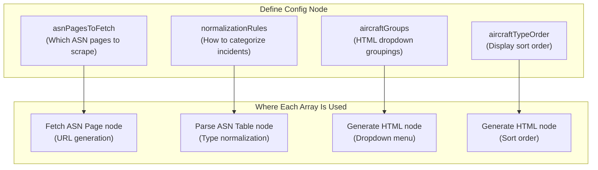

#### Array 1: asnPagesToFetch

**Purpose**: Defines which ASN type pages to scrape for incident data.

**Structure**: Simple array of ICAO type codes.

```javascript
const asnPagesToFetch = [
  'C525', 'C25A', 'C25B', 'C25C', 'C25M',  // CE525 Series
  'C500', 'C501', 'C550', 'C551', 'S550', 'C560',  // CE500 Series
  'C56X',  // CE560XL Series
  'CL30', 'CL35'  // Challengers
];
```

**How it works**: The node generates URLs in the format `https://aviation-safety.net/asndb/type/{ICAO}` for each code. It also generates pagination URLs (page 2, page 3) for aircraft with extensive accident histories.

**Finding ICAO codes**: Visit `https://aviation-safety.net/asndb/type/{CODE}` to verify a code exists. You can also search ASN for an aircraft and look at the URL of the type page.

---

#### Array 2: normalizationRules

**Purpose**: Maps the `aircraft_type` text from ASN to the correct ICAO code and display name.

**Structure**: Array of objects with `match`, `icao`, and `name` properties. Rules are checked in order; first match wins.

```javascript
const normalizationRules = [
  // Specific models checked FIRST (more specific matches)
  { match: 'CJ4', icao: 'C25C', name: 'Citation CJ4' },
  { match: '525C', icao: 'C25C', name: 'Citation CJ4' },
  { match: 'CJ3', icao: 'C25B', name: 'Citation CJ3/CJ3+' },
  
  // Generic matches checked LAST (less specific)
  { match: '525', icao: 'C525', name: 'CitationJet/CJ1' },
];
```

**Critical**: Rules are checked in order. Place more specific matches before generic ones. For example, `CJ4` must come before `525` because a "Cessna 525C Citation CJ4" contains both strings.

---

#### Array 3: aircraftGroups

**Purpose**: Defines groupings for the HTML dashboard dropdown filter (e.g., "All CE525 Aircraft").

**Structure**: Array of objects with `id`, `name`, and `types` properties.

```javascript
const aircraftGroups = [
  { id: 'ce525', name: 'All CE525 Aircraft', types: ['C525', 'C25A', 'C25B', 'C25C', 'C25M'] },
  { id: 'ce500', name: 'All CE500 Aircraft', types: ['C500', 'C501', 'C550', 'C551', 'S550', 'C560'] },
  { id: 'ce560xl', name: 'All CE560XL Aircraft', types: ['C56X'] },
  { id: 'challenger', name: 'All CL30 / CL35 Aircraft', types: ['CL30', 'CL35'] }
];
```

**The `id` field**: Used as the HTML option value and to generate JavaScript variable names. Must be a valid JavaScript identifier (no spaces, hyphens, or special characters).

**The `types` array**: Must contain ICAO codes that match what your normalization rules produce.

---

#### Array 4: aircraftTypeOrder

**Purpose**: Controls the display order of individual aircraft types in the HTML dropdown (after the groups).

**Structure**: Simple array of ICAO codes in desired display order.

```javascript
const aircraftTypeOrder = [
  'C525', 'C25A', 'C25B', 'C25C', 'C25M',  // CE525 first
  'C500', 'C501', 'C550', 'C551', 'S550', 'C560',  // Then CE500
  'C56X',  // Then XL
  'CL30', 'CL35'  // Challengers last
];
```

**Behavior**: Aircraft types not in this array will appear at the end, sorted alphabetically.

---

### Why Normalization Rules Exist

Normalization rules solve a critical data quality problem: **ASN cross-lists aircraft variants on related model pages**, and the `aircraft_type` field in ASN's tables often differs from the page's ICAO code.

#### The Problem

Consider the C525 (CitationJet) page on ASN. This page contains incidents for:
- CitationJet (original) - should be C525
- CJ1 - should be C525
- CJ1+ - should be C525
- **CJ4** - should be **C25C**, not C525!

ASN groups related aircraft on the same page for user convenience, but this means you cannot rely on the page URL to determine the correct ICAO code. The `aircraft_type` field in each row contains the actual aircraft designation.

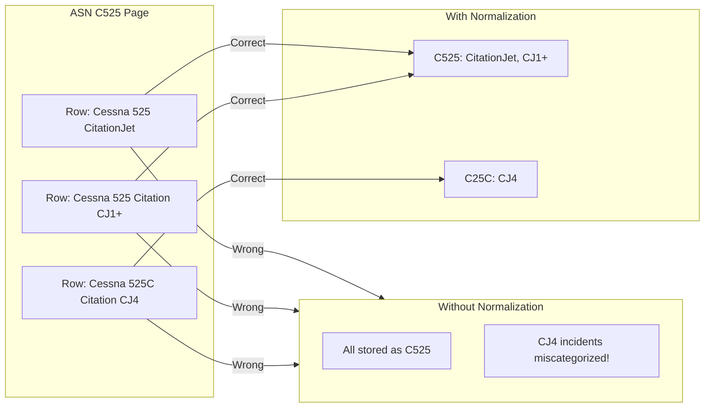

#### How Normalization Works

The `Parse ASN Table` node extracts the `aircraft_type` text from each row and runs it through the normalization rules:

```javascript
const normalizeAircraftType = (aircraftType) => {
  const text = aircraftType || '';
  const upper = text.toUpperCase();
  
  for (const rule of normalizationRules) {
    if (upper.includes(rule.match.toUpperCase())) {
      return { icao: rule.icao, name: rule.name };
    }
  }
  return null;  // No match - use page ICAO as fallback
};
```

**Key insight**: The function checks if the `aircraft_type` text **contains** the match string (case-insensitive). This allows flexible matching like:
- "Cessna 525C Citation CJ4" contains "CJ4" -> maps to C25C
- "Cessna 172S Skyhawk SP" contains "172" -> maps to C172

---

### Step-by-Step: Adding New Aircraft

Follow these steps to add new aircraft types to the workflow.

#### Step 1: Find the ICAO Code

Visit `https://aviation-safety.net/asndb/type/` and search for your aircraft. Note the ICAO code from the URL. For example:
- Cessna 172: `https://aviation-safety.net/asndb/type/C172` -> Code is `C172`
- Beechcraft King Air 350: `https://aviation-safety.net/asndb/type/B350` -> Code is `B350`

#### Step 2: Research Variants

Click through to the ASN page and examine the `aircraft_type` column in the incident table. Note all the different ways the aircraft type is listed. For example, on the C172 page you might see:
- "Cessna 172"
- "Cessna 172S Skyhawk SP"
- "Cessna 172R Skyhawk"
- "Cessna 172N Skyhawk"
- "Reims/Cessna F172M"

#### Step 3: Update asnPagesToFetch

Add the ICAO code to the array:

```javascript
const asnPagesToFetch = [
  // Existing types...
  'C172',  // Add new type
];
```

#### Step 4: Create Normalization Rules

Add rules for each variant you found. Order matters - more specific first:

```javascript
const normalizationRules = [
  // Existing rules...
  
  // New: Cessna 172 variants
  { match: 'Reims/Cessna F172', icao: 'C172', name: 'Cessna 172 (Reims)' },
  { match: '172S', icao: 'C172', name: 'Cessna 172S Skyhawk SP' },
  { match: '172R', icao: 'C172', name: 'Cessna 172R Skyhawk' },
  { match: '172', icao: 'C172', name: 'Cessna 172' },  // Generic last
];
```

#### Step 5: Add to aircraftTypeOrder

Add the ICAO code where you want it to appear in the dropdown:

```javascript
const aircraftTypeOrder = [
  // Existing types...
  'C172',  // Add new type
];
```

#### Step 6: Create or Update aircraftGroups (Optional)

If adding multiple related types, create a group:

```javascript
const aircraftGroups = [
  // Existing groups...
  { id: 'cessna_piston', name: 'All Cessna Piston Singles', types: ['C152', 'C172', 'C182', 'C206', 'C207', 'C210'] },
];
```

#### Step 7: Test

Save the workflow and trigger a manual run:

```bash
curl -X POST https://your-domain.com/webhook/citation-monitor-run
```

Check the execution logs to verify incidents are being parsed and normalized correctly.

---

### Step-by-Step: Removing Aircraft

To stop monitoring an aircraft type:

#### Step 1: Remove from asnPagesToFetch

```javascript
const asnPagesToFetch = [
  'C525', 'C25A', 'C25B', 'C25C', 'C25M',
  // 'C500',  // Removed - no longer monitoring
  'C501', 'C550', 'C551', 'S550', 'C560',
];
```

#### Step 2: Remove from aircraftTypeOrder

```javascript
const aircraftTypeOrder = [
  'C525', 'C25A', 'C25B', 'C25C', 'C25M',
  // 'C500',  // Removed
  'C501', 'C550', 'C551', 'S550', 'C560',
];
```

#### Step 3: Update aircraftGroups

Remove from any group's `types` array:

```javascript
{ id: 'ce500', name: 'All CE500 Aircraft', types: ['C501', 'C550', 'C551', 'S550', 'C560'] },  // C500 removed
```

#### Step 4: Keep or Remove Normalization Rules

You can leave normalization rules in place (they won't match if you're not fetching that page) or remove them for cleanliness.

**Important**: Existing database records are NOT deleted. The workflow follows a "never delete" philosophy. If you want to remove historical data, you must do so manually:

```bash
docker exec -it n8n_postgres psql -U n8n -d citation_accidents -c \
  "DELETE FROM citation_incidents WHERE icao_code = 'C500';"
```

---

### Complete Example: Cessna Piston Singles

This example shows how to completely replace the Citation configuration with Cessna piston single-engine aircraft: 152, 172, 182, 206, 207, and 210.

#### Step 1: Research ASN Pages

First, verify each ICAO code exists on ASN:

| Aircraft | ASN URL | ICAO Code |
|----------|---------|-----------|  
| Cessna 152 | https://aviation-safety.net/asndb/type/C152 | C152 |
| Cessna 172 | https://aviation-safety.net/asndb/type/C172 | C172 |
| Cessna 182 | https://aviation-safety.net/asndb/type/C182 | C182 |
| Cessna 206 | https://aviation-safety.net/asndb/type/C206 | C206 |
| Cessna 207 | https://aviation-safety.net/asndb/type/C207 | C207 |
| Cessna 210 | https://aviation-safety.net/asndb/type/C210 | C210 |

#### Step 2: Examine Variants on Each Page

Visit each ASN page and note the different `aircraft_type` values you see. For example:

**C152 page variants:**
- Cessna 152
- Cessna A152 Aerobat
- Reims/Cessna F152
- Reims/Cessna FA152 Aerobat

**C172 page variants:**
- Cessna 172, 172A through 172S
- Cessna 172 Skyhawk
- Cessna 172S Skyhawk SP
- Reims/Cessna F172 variants
- Cessna R172K Hawk XP

**C182 page variants:**
- Cessna 182, 182A through 182T
- Cessna 182 Skylane
- Cessna 182T Skylane
- Reims/Cessna F182 variants
- Cessna R182 Skylane RG
- Cessna TR182 Turbo Skylane RG

**C206 page variants:**
- Cessna 206, U206, TU206
- Cessna 206 Stationair
- Cessna U206G Stationair
- Cessna T206H Turbo Stationair

**C207 page variants:**
- Cessna 207, 207A
- Cessna 207 Skywagon
- Cessna 207A Stationair 7

**C210 page variants:**
- Cessna 210, 210A through 210N
- Cessna 210 Centurion
- Cessna T210 Turbo Centurion
- Cessna P210 Pressurized Centurion

#### Step 3: Complete Define Config Code

Here is the complete configuration to replace in the Define Config node:

```javascript
// ============================================================
// ASN PAGES TO FETCH
// ============================================================
const asnPagesToFetch = [
  'C152',  // Cessna 152/Aerobat
  'C172',  // Cessna 172 Skyhawk
  'C182',  // Cessna 182 Skylane
  'C206',  // Cessna 206 Stationair
  'C207',  // Cessna 207 Skywagon/Stationair
  'C210',  // Cessna 210 Centurion
];

// ============================================================
// AIRCRAFT TYPE ORDER (for HTML dropdown display)
// ============================================================
const aircraftTypeOrder = [
  'C152', 'C172', 'C182', 'C206', 'C207', 'C210'
];

// ============================================================
// NORMALIZATION RULES
// Checked IN ORDER - more specific matches FIRST
// ============================================================
const normalizationRules = [
  // ---- Cessna 152 ----
  { match: 'FA152', icao: 'C152', name: 'Cessna A152 Aerobat (Reims)' },
  { match: 'F152', icao: 'C152', name: 'Cessna 152 (Reims)' },
  { match: 'A152', icao: 'C152', name: 'Cessna A152 Aerobat' },
  { match: '152', icao: 'C152', name: 'Cessna 152' },
  
  // ---- Cessna 172 ----
  // Specific models first
  { match: 'R172K', icao: 'C172', name: 'Cessna R172K Hawk XP' },
  { match: 'FR172', icao: 'C172', name: 'Cessna FR172 (Reims)' },
  { match: 'F172', icao: 'C172', name: 'Cessna F172 (Reims)' },
  { match: '172S', icao: 'C172', name: 'Cessna 172S Skyhawk SP' },
  { match: '172R', icao: 'C172', name: 'Cessna 172R Skyhawk' },
  { match: '172P', icao: 'C172', name: 'Cessna 172P Skyhawk' },
  { match: '172N', icao: 'C172', name: 'Cessna 172N Skyhawk' },
  { match: '172M', icao: 'C172', name: 'Cessna 172M Skyhawk' },
  { match: 'Skyhawk', icao: 'C172', name: 'Cessna 172 Skyhawk' },
  { match: '172', icao: 'C172', name: 'Cessna 172' },
  
  // ---- Cessna 182 ----
  // Retractable gear variants first
  { match: 'TR182', icao: 'C182', name: 'Cessna TR182 Turbo Skylane RG' },
  { match: 'R182', icao: 'C182', name: 'Cessna R182 Skylane RG' },
  { match: 'FR182', icao: 'C182', name: 'Cessna FR182 (Reims)' },
  { match: 'F182', icao: 'C182', name: 'Cessna F182 Skylane (Reims)' },
  { match: '182T', icao: 'C182', name: 'Cessna 182T Skylane' },
  { match: '182S', icao: 'C182', name: 'Cessna 182S Skylane' },
  { match: 'Skylane', icao: 'C182', name: 'Cessna 182 Skylane' },
  { match: '182', icao: 'C182', name: 'Cessna 182' },
  
  // ---- Cessna 206 ----
  // Turbo variants first
  { match: 'T206H', icao: 'C206', name: 'Cessna T206H Turbo Stationair' },
  { match: 'TU206', icao: 'C206', name: 'Cessna TU206 Turbo Stationair' },
  { match: 'T206', icao: 'C206', name: 'Cessna T206 Turbo Stationair' },
  { match: 'U206G', icao: 'C206', name: 'Cessna U206G Stationair' },
  { match: 'U206', icao: 'C206', name: 'Cessna U206 Stationair' },
  { match: 'P206', icao: 'C206', name: 'Cessna P206 Super Skylane' },
  { match: 'Stationair 6', icao: 'C206', name: 'Cessna 206 Stationair 6' },
  { match: '206', icao: 'C206', name: 'Cessna 206' },
  
  // ---- Cessna 207 ----
  { match: 'T207', icao: 'C207', name: 'Cessna T207 Turbo Skywagon' },
  { match: '207A', icao: 'C207', name: 'Cessna 207A Stationair 7' },
  { match: 'Stationair 7', icao: 'C207', name: 'Cessna 207 Stationair 7' },
  { match: 'Skywagon 207', icao: 'C207', name: 'Cessna 207 Skywagon' },
  { match: '207', icao: 'C207', name: 'Cessna 207' },
  
  // ---- Cessna 210 ----
  // Pressurized and Turbo first
  { match: 'P210', icao: 'C210', name: 'Cessna P210 Pressurized Centurion' },
  { match: 'T210', icao: 'C210', name: 'Cessna T210 Turbo Centurion' },
  { match: 'Centurion', icao: 'C210', name: 'Cessna 210 Centurion' },
  { match: '210', icao: 'C210', name: 'Cessna 210' },
];

// ============================================================
// AIRCRAFT GROUPS (for HTML dropdown)
// ============================================================
const aircraftGroups = [
  { 
    id: 'trainers', 
    name: 'Training Aircraft (152/172)', 
    types: ['C152', 'C172'] 
  },
  { 
    id: 'skylane', 
    name: 'All 182 Skylane', 
    types: ['C182'] 
  },
  { 
    id: 'utility', 
    name: 'Utility Aircraft (206/207)', 
    types: ['C206', 'C207'] 
  },
  { 
    id: 'centurion', 
    name: 'All 210 Centurion', 
    types: ['C210'] 
  },
  { 
    id: 'high_performance', 
    name: 'High Performance (182/206/207/210)', 
    types: ['C182', 'C206', 'C207', 'C210'] 
  },
];
```

#### Step 4: Update HTML Configuration (Optional)

You may also want to update the `htmlConfig` object to reflect the new focus:

```javascript
const htmlConfig = {
  background: './map_background.gif',
  logo: './your_logo.png',
  logoWidth: 260,
  logoHeight: 200,
  title: 'Cessna Piston Single Incidents and Accidents',
  homeUrl: 'https://your-site.com',
  quote: '"Flying is learning how to throw yourself at the ground and miss." — Douglas Adams'
};
```

#### Step 5: Database Considerations

If you are completely replacing the aircraft types (not adding to existing), you have two options:

**Option A: Keep existing data (recommended)**

The existing Citation data remains in the database but will not appear in the HTML dropdown since those ICAO codes are no longer in `aircraftTypeOrder`. The data is preserved for historical reference.

**Option B: Clear existing data**

If you want a fresh start, clear the database:

```bash
# CAUTION: This permanently deletes all incident data!
docker exec -it n8n_postgres psql -U n8n -d citation_accidents -c \
  "TRUNCATE TABLE citation_incidents RESTART IDENTITY;"
```

#### Step 6: Test the Configuration

After making changes:

1. Save the workflow
2. Run a manual test:
   ```bash
   curl -X POST https://your-domain.com/webhook/citation-monitor-run
   ```
3. Check the n8n execution log for:
   - Number of pages fetched (should be 6 pages x 3 pagination = 18 URLs)
   - Number of incidents parsed
   - Any normalization warnings
4. View the generated HTML dashboard
5. Verify the dropdown contains your new groups and aircraft types

#### Configuration Summary

| Array | Entries | Purpose |
|-------|---------|--------|
| `asnPagesToFetch` | 6 ICAO codes | URLs to scrape |
| `aircraftTypeOrder` | 6 ICAO codes | Dropdown sort order |
| `normalizationRules` | 32 rules | Type text to ICAO mapping |
| `aircraftGroups` | 5 groups | Dropdown group filters |

This configuration will monitor approximately 2,000+ incidents across these popular Cessna piston singles, depending on the ASN database size at the time of collection.

---

## Quick Start with n8n_nginx

The fastest way to get up and running is using my [n8n_nginx](https://github.com/rjsears/n8n_nginx) repository, which provides a complete Docker-based n8n setup with PostgreSQL, Nginx reverse proxy, and automatic SSL certificates.

### Step 1: Deploy n8n Infrastructure (15-20 minutes)

```bash
# Clone the n8n_nginx repository
git clone https://github.com/rjsears/n8n_nginx
cd n8n_nginx

# Copy and configure the environment file
cp .env.example .env
nano .env  # Edit with your domain, email, and passwords

# Start the stack
docker-compose up -d

# Verify everything is running
docker-compose ps
```

This gives you:
- n8n workflow automation platform
- PostgreSQL database (ready for our workflow)
- Nginx reverse proxy with automatic SSL
- Secure webhook endpoints

### Step 2: Set Up the Accident Tracker (5-10 minutes)

```bash
# Create the citation_accidents database
docker exec -it n8n_postgres psql -U n8n -c "CREATE DATABASE citation_accidents;"

# Create output directory for HTML reports
mkdir -p /path/to/n8n_nginx/accident_results
```

### Step 3: Import and Configure the Workflow

1. Open n8n at `https://your-domain.com`
2. Go to **Workflows** → **Import from File** → Select `workflow.json`
3. Configure credentials (see [Credentials Setup](#step-4-configure-credentials))
4. Enable and run the **Create Table (Run Once)** node once, then disable it again
5. **Activate** the workflow

### Step 4: Test It

```bash
curl -X POST https://your-domain.com/webhook/citation-monitor-run
```

That's it! The workflow will now run daily at 8 AM (or your defined time) and collect aircraft incident data.

---

## Quick Start (Manual Docker Setup)

If you prefer to set up Docker manually without the n8n_nginx stack:

```bash
# 1. Clone the repository
git clone https://github.com/rjsears/aircraft_accident_tracker
cd aircraft_accident_tracker

# 2. Create environment file
cp .env.example .env
# Edit .env with your passwords and API keys

# 3. Start Docker containers
docker-compose up -d

# 4. Create the database
docker exec -it n8n_postgres psql -U n8n -c "CREATE DATABASE citation_accidents;"

# 5. Open n8n and import the workflow
# Navigate to http://localhost:5678
# Go to Workflows → Import from File → Select workflow.json

# 6. Configure credentials in n8n
# See "Credentials Setup" section below

# 7. Initialize the database table
# In n8n: Enable "Create Table (Run Once)" node → Click "Manual Init Trigger" 
#         → Test Workflow → Disable the node → Save

# 8. Activate the workflow and test
curl -X POST http://localhost:5678/webhook/citation-monitor-run
```

---

## Detailed Installation

### Prerequisites

| Requirement | Version | Notes |
|-------------|---------|-------|
| Docker | 20.10+ | Required |
| Docker Compose | 2.0+ | Required |
| OpenAI API Key | — | Required for AI summaries |
| SerpAPI Key | — | Optional, for Google link enrichment |

### Obtaining API Keys

#### OpenAI API Key (Required)

1. Create an OpenAI account at [platform.openai.com](https://platform.openai.com/signup)
2. Add billing information at [platform.openai.com/account/billing](https://platform.openai.com/account/billing)
3. Generate an API key at [platform.openai.com/api-keys](https://platform.openai.com/api-keys)
4. Copy the key immediately—it won't be shown again!

> ** Cost Tip:** This project uses GPT-5.1 which is cost-effective for summarization tasks. Processing 100 incidents typically costs less than $0.50.

#### SerpAPI Key (Optional)

1. Create a SerpAPI account at [serpapi.com](https://serpapi.com/users/sign_up)
2. Choose a plan (free tier: 250 searches/month)
3. Get your API key from [serpapi.com/manage-api-key](https://serpapi.com/manage-api-key)

### Step 1: Docker Setup

Create your project directory and `docker-compose.yml`:

```yaml
version: '3.8'

services:
  n8n:
    image: n8nio/n8n:latest
    container_name: n8n
    restart: unless-stopped
    ports:
      - "5678:5678"
    volumes:
      - n8n_data:/home/node/.n8n
      - ./accident_results:/home/n8n/accident_results
    environment:
      - N8N_BASIC_AUTH_ACTIVE=true
      - N8N_BASIC_AUTH_USER=${N8N_USER:-admin}
      - N8N_BASIC_AUTH_PASSWORD=${N8N_PASSWORD}
      - WEBHOOK_URL=${WEBHOOK_URL:-http://localhost:5678/}
      - GENERIC_TIMEZONE=${TIMEZONE:-America/Los_Angeles}
    networks:
      - app_network
    depends_on:
      - postgres

  postgres:
    image: postgres:15-alpine
    container_name: n8n_postgres
    restart: unless-stopped
    environment:
      - POSTGRES_USER=n8n
      - POSTGRES_PASSWORD=${DB_PASSWORD}
      - POSTGRES_DB=n8n
    volumes:
      - postgres_data:/var/lib/postgresql/data
    networks:
      - app_network

volumes:
  n8n_data:
  postgres_data:

networks:
  app_network:
```

### Step 2: Database Setup

```bash
docker exec -it n8n_postgres psql -U n8n -c "CREATE DATABASE citation_accidents;"
```

### Step 3: Import the Workflow

1. Open n8n at `http://localhost:5678`
2. Go to **Workflows** → **Import from File**
3. Select `workflow.json`
4. Click **Save**

### Step 4: Configure Credentials

In n8n, go to **Settings** → **Credentials** and create:

#### PostgreSQL Credential

| Field | Value |
|-------|-------|
| Name | `Postgres Citation Accidents` |
| Host | `n8n_postgres` |
| Database | `citation_accidents` |
| User | `n8n` |
| Password | *Your DB_PASSWORD* |
| Port | `5432` |

#### OpenAI Credential

| Field | Value |
|-------|-------|
| Name | `OpenAI` |
| API Key | *Your OpenAI API key* |

#### SerpAPI Key

Configure directly in the **Search Google Links** node's `api_key` query parameter.

### Step 5: Initialize Database

1. Find **Create Table (Run Once)** node (disabled by default)
2. Toggle **Disabled** to OFF
3. Click **Manual Init Trigger** → **Test Workflow**
4. Toggle the node back to **Disabled**
5. Save the workflow

### Step 6: Activate and Test

```bash
curl -X POST http://localhost:5678/webhook/citation-monitor-run
```

---

## Configuration Guide

### Aircraft Types

The workflow monitors aircraft types defined in **Define Config**:

| ICAO | Aircraft | Series |
|------|----------|--------|
| C525 | CitationJet/CJ1 | CE525 |
| C25A | Citation CJ2/CJ2+ | CE525 |
| C25B | Citation CJ3/CJ3+ | CE525 |
| C25C | Citation CJ4 | CE525 |
| C25M | Citation M2 | CE525 |
| C500 | Citation I | CE500 |
| C501 | Citation I/SP | CE500 |
| C550 | Citation II/Bravo | CE500 |
| C551 | Citation II/SP | CE500 |
| S550 | Citation S/II | CE500 |
| C560 | Citation V/Ultra/Encore | CE500 |
| C56X | Citation Excel/XLS | CE560XL |
| CL30 | Challenger 300 | Challenger |
| CL35 | Challenger 350 | Challenger |

### Processing Limits

| Setting | Default | Location |
|---------|---------|----------|
| SerpAPI limit (all paths) | 1000 | `Filter For Enrichment`, `Filter SerpAPI Candidates` |
| Deep refresh window | 12 months | `Query Refresh Candidates` |
| HTTP batch size | 5 requests | All HTTP nodes |
| Rate limit delay | 2000ms | All HTTP nodes |

---

## Usage & Operations

### Webhook Reference

| Purpose | Command |
|---------|---------|
| Full collection | `curl -X POST https://your-domain.com/webhook/citation-monitor-run` |
| Deep refresh | `curl -X POST https://your-domain.com/webhook/citation-deep-refresh` |
| Link enrichment | `curl -X POST https://your-domain.com/webhook/citation-serpapi-links` |
| AI processing | `curl -X POST https://your-domain.com/webhook/citation-ai-narrative` |

### Database Queries

**Check status:**
```bash
docker exec -it n8n_postgres psql -U n8n -d citation_accidents -c "
SELECT 
  COUNT(*) as total_incidents,
  COUNT(narrative_summary) as with_ai,
  COUNT(*) FILTER (WHERE fatalities > 0) as fatal
FROM citation_incidents;"
```

**View recent:**
```bash
docker exec -it n8n_postgres psql -U n8n -d citation_accidents -c "
SELECT registration, incident_date, icao_code, fatalities 
FROM citation_incidents ORDER BY incident_date DESC LIMIT 10;"
```

### Backup

```bash
docker exec n8n_postgres pg_dump -U n8n citation_accidents > backup_$(date +%Y%m%d).sql
```

---

## Database Schema

### Table: `citation_incidents`

| Column | Type | Description |
|--------|------|-------------|
| `id` | SERIAL | Primary key |
| `registration` | VARCHAR(20) | Aircraft tail number |
| `date_string` | VARCHAR(50) | Original date from ASN |
| `incident_date` | DATE | Parsed date for sorting |
| `icao_code` | VARCHAR(10) | Normalized ICAO type code |
| `aircraft_name` | VARCHAR(100) | Display name |
| `aircraft_type` | VARCHAR(100) | Specific type from ASN |
| `operator` | VARCHAR(200) | Aircraft operator |
| `location` | VARCHAR(300) | Incident location |
| `fatalities` | INTEGER | Fatality count |
| `fatalities_raw` | VARCHAR(50) | Raw string (e.g., "2+1") |
| `damage` | VARCHAR(20) | Damage code (w/o, sub, min, non) |
| `severity` | VARCHAR(50) | Computed severity |
| `source_url` | TEXT | ASN wikibase URL |
| `source` | VARCHAR(100) | Data source identifier |
| `raw_narrative` | TEXT | Full narrative from ASN |
| `raw_narrative_hash` | VARCHAR(32) | Hash for change detection |
| `narrative_summary` | TEXT | AI-generated summary |
| `additional_links` | JSONB | Array of enrichment links |
| `is_new` | BOOLEAN | Recent incident flag |
| `serpapi_searched_at` | TIMESTAMP | Last Google search time |
| `created_at` | TIMESTAMP | Record creation time |
| `updated_at` | TIMESTAMP | Last update time |

**Unique constraint:** `(registration, date_string)`

---

## Troubleshooting

### Common Issues

| Issue | Solution |
|-------|----------|
| No incidents appearing | Verify ASN accessibility, check ICAO codes |
| AI summaries not generating | Check OpenAI API key and quota |
| Google links not appearing | Verify SerpAPI key, ensure incident is fatal/substantial |
| HTML not updating | Check file permissions, verify workflow completed |
| Webhooks return 404 | Activate workflow, verify WEBHOOK_URL |

### Reset Incident for Reprocessing

```bash
# Clear AI summary
docker exec -it n8n_postgres psql -U n8n -d citation_accidents -c \
  "UPDATE citation_incidents SET narrative_summary = NULL WHERE registration = 'N123AB';"

# Clear links and allow re-search
docker exec -it n8n_postgres psql -U n8n -d citation_accidents -c \
  "UPDATE citation_incidents SET additional_links = '[]', serpapi_searched_at = NULL WHERE registration = 'N123AB';"
```

---

## Contributing

Contributions are welcome! Please:

1. Fork the repository
2. Create a feature branch
3. Make your changes
4. Test with multiple aircraft types
5. Update documentation if needed
6. Open a Pull Request

---

## License

This project is licensed under the MIT License. See [LICENSE](LICENSE) for details.

---

## Acknowledgments

- [Aviation Safety Network](https://aviation-safety.net) — Primary data source
- [n8n](https://n8n.io) — Workflow automation platform
- [OpenAI](https://openai.com) — AI narrative generation
- [SerpAPI](https://serpapi.com) — Google search integration

---

## Support

- **Issues:** [GitHub Issues](https://github.com/rjsears/aircraft_accident_tracker/issues)
- **Discussions:** [GitHub Discussions](https://github.com/rjsears/aircraft_accident_tracker/discussions)

---

## Special Thanks

* **My amazing and loving family!** My family puts up with all my coding and automation projects and encourages me in everything. Without them, my projects would not be possible.
* **My brother James**, who is a continual source of inspiration to me and others. Everyone should have a brother as awesome as mine!
