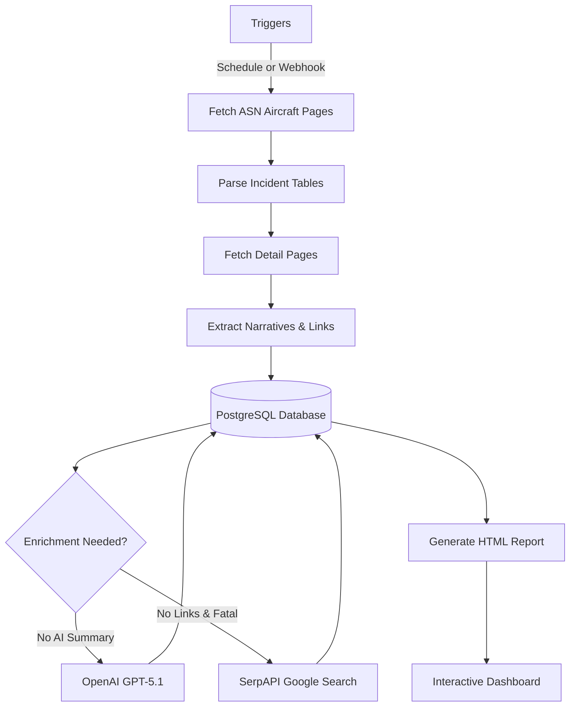

# Aircraft Accident Tracker

[](https://n8n.io)
[](https://www.postgresql.org/)
[](https://openai.com)


[](LICENSE)


>### *"Those who cannot remember the past are condemned to repeat it."* — George Santayana

---

## What This Project Does

The Aircraft Accident Tracker is an automated safety intelligence system that tracks incidents and accidents involving Cessna Citation aircraft, although it is easily adapted for any aircraft. It continuously monitors the [Aviation Safety Network (ASN)](https://aviation-safety.net) database, extracting incident data including locations, operators, damage assessments, and full narrative reports. Each incident is then enriched with an AI-generated summary using OpenAI's GPT-5.1 model, which distills lengthy investigation narratives into concise overviews. For fatal and serious accidents as well as aircraft marked as `w/o` (written off), the system also searches Google via SerpAPI to discover related NTSB investigation reports, news coverage, flight tracking data, and photos, automatically categorizing and linking these resources for easy access.

The entire system runs as an n8n workflow with PostgreSQL storage, designed for hands-off operation. A scheduled trigger runs daily at 8 AM (user defined) to collect new incidents and process enrichments, while four additional webhook endpoints allow on-demand execution of specific processing phases. The workflow implements intelligent deduplication using composite keys on aircraft registration and date, hash-based change detection to identify when ASN updates their narratives, and rate limiting to respect external service quotas. All data flows into an interactive HTML dashboard that supports filtering by aircraft type, date range, keywords, and fatality status, with expandable rows showing full incident details alongside categorized resource links.
  
  
> ** New to n8n?** Check out my [n8n_nginx](https://github.com/rjsears/n8n_nginx) repository for a complete n8n + PostgreSQL + Nginx setup with SSL. You can have a production-ready n8n instance running in about 20 minutes! See the [Quick Start with n8n_nginx](#-quick-start-with-n8n_nginx) section below. 

---

## Table of Contents

- [Features](#-features)
- [How It Works](#-how-it-works)
- [Quick Start with n8n_nginx](#-quick-start-with-n8n_nginx)
- [Quick Start (Manual)](#quick-start-manual-docker-setup)
- [Detailed Installation](#-detailed-installation)
- [Configuration Guide](#-configuration-guide)
- [Usage & Operations](#-usage--operations)
- [Architecture Reference](#-architecture-reference)
- [Database Schema](#-database-schema)
- [Troubleshooting](#-troubleshooting)
- [Contributing](#-contributing)
- [License](#-license)

---

## ✨ Features

### Automated Data Collection
- **Multi-aircraft monitoring** — Track multiple Citation models simultaneously (CE525 series, CE500 series, CE560XL series, and Bombardier Challengers)
- **Automatic pagination** — Handles ASN's paginated results, fetching all pages for aircraft types with extensive accident histories
- **Full narrative extraction** — Pulls complete investigation reports from ASN detail pages
- **Smart deduplication** — Composite key prevents duplicate records while allowing updates
- **Change detection** — Hash-based tracking identifies when ASN updates their narratives

### AI-Powered Enrichment
- **GPT-5.1 summaries** — Transforms lengthy narratives into concise 4-6 sentence overviews
- **Factual extraction only** — AI is prompted to use only stated facts, no speculation
- **Batch processing** — Efficiently handles large backlogs with rate limiting

### Intelligent Link Discovery
- **Google Search integration** — Finds NTSB reports, news articles, videos, and photos
- **Quality filtering** — Whitelist/blacklist system ensures relevant, trusted sources
- **Auto-categorization** — Links tagged by type (NTSB, FAA, News, Video, Photo)
- **Auto-generated FAA links** — Registry lookup links added for all N-number aircraft

### Interactive Dashboard
- **Multiple filter options** — Aircraft type, registration, date range, keywords, fatal-only
- **Live statistics** — Total incidents, fatal count, total fatalities, recent incidents
- **Expandable details** — Click any row for full incident information
- **Side-by-side layout** — Aircraft details paired with AI summary and resource links

### Operational Flexibility
- **Scheduled automation** — Daily runs at 8 AM with no intervention needed
- **Webhook triggers** — Five endpoints for targeted on-demand processing
- **Deep refresh** — Re-check ASN for updated narratives on recent incidents
- **Graceful handling** — Empty batches and API errors handled without workflow failures

---

## How It Works



**Processing Flow:**

1. **Collection** — Fetches ASN type pages for configured aircraft (including paginated results for types with many incidents), parses incident tables, then fetches individual detail pages to extract full narratives and source links

2. **Storage** — Upserts all incidents to PostgreSQL using registration + date as the deduplication key, preserving existing AI summaries and links during updates

3. **AI Enrichment** — Identifies incidents with raw narratives but no AI summary, sends to GPT-5.1 with a strict factual-only prompt

4. **Link Enrichment** — For fatal incidents lacking Google-sourced links, searches Google and filters results through whitelist/blacklist rules

5. **Output** — Regenerates the interactive HTML dashboard after each processing run

---

## 🚀 Quick Start with n8n_nginx

The fastest way to get up and running is using my [n8n_nginx](https://github.com/rjsears/n8n_nginx) repository, which provides a complete Docker-based n8n setup with PostgreSQL, Nginx reverse proxy, and automatic SSL certificates.

### Step 1: Deploy n8n Infrastructure (15-20 minutes)

```bash
# Clone the n8n_nginx repository
git clone https://github.com/rjsears/n8n_nginx
cd n8n_nginx

# Copy and configure the environment file
cp .env.example .env
nano .env  # Edit with your domain, email, and passwords

# Start the stack
docker-compose up -d

# Verify everything is running
docker-compose ps
```

This gives you:
- ✅ n8n workflow automation platform
- ✅ PostgreSQL database (ready for our workflow)
- ✅ Nginx reverse proxy with automatic SSL
- ✅ Secure webhook endpoints

### Step 2: Set Up the Accident Tracker (5-10 minutes)

```bash
# Create the citation_accidents database
docker exec -it n8n_postgres psql -U n8n -c "CREATE DATABASE citation_accidents;"

# Create output directory for HTML reports
mkdir -p /path/to/n8n_nginx/accident_results
```

### Step 3: Import and Configure the Workflow

1. Open n8n at `https://your-domain.com`
2. Go to **Workflows** → **Import from File** → Select `workflow.json`
3. Configure credentials (see [Credentials Setup](#step-4-configure-credentials))
4. Enable and run the **Create Table (Run Once)** node once, then disable it again
5. **Activate** the workflow

### Step 4: Test It

```bash
curl -X POST https://your-domain.com/webhook/citation-monitor-run
```

That's it! The workflow will now run daily at 8 AM (or your defined time) and collect aircraft incident data.

---

## Quick Start (Manual Docker Setup)

If you prefer to set up Docker manually without the n8n_nginx stack:

```bash
# 1. Clone the repository
git clone https://github.com/rjsears/aircraft_accident_tracker
cd aircraft_accident_tracker

# 2. Create environment file
cp .env.example .env
# Edit .env with your passwords and API keys

# 3. Start Docker containers
docker-compose up -d

# 4. Create the database
docker exec -it n8n_postgres psql -U n8n -c "CREATE DATABASE citation_accidents;"

# 5. Open n8n and import the workflow
# Navigate to http://localhost:5678
# Go to Workflows → Import from File → Select workflow.json

# 6. Configure credentials in n8n
# See "Credentials Setup" section below

# 7. Initialize the database table
# In n8n: Enable "Create Table (Run Once)" node → Click "Manual Init Trigger" 
#         → Test Workflow → Disable the node → Save

# 8. Activate the workflow and test
curl -X POST http://localhost:5678/webhook/citation-monitor-run
```

---

## Detailed Installation

### Prerequisites

| Requirement | Version | Notes |
|-------------|---------|-------|
| Docker | 20.10+ | Required |
| Docker Compose | 2.0+ | Required |
| OpenAI API Key | — | Required for AI summaries |
| SerpAPI Key | — | Optional, for Google link enrichment |

### Obtaining API Keys

#### OpenAI API Key (Required)
(You can use whatever agent you choose, I had the best luck with OpenAI)

The OpenAI API key is required to generate AI-powered narrative summaries for each incident.

1. **Create an OpenAI account** at [platform.openai.com](https://platform.openai.com/signup)
2. **Verify your email** and complete account setup
3. **Add billing information** at [platform.openai.com/account/billing](https://platform.openai.com/account/billing)
   - OpenAI requires a payment method on file
   - You can set usage limits to control costs
   - Typical usage for this project: $1-5/month depending on incident volume
4. **Generate an API key**:
   - Go to [platform.openai.com/api-keys](https://platform.openai.com/api-keys)
   - Click **"Create new secret key"**
   - Give it a name (e.g., "Aircraft Accident Monitor")
   - **Copy the key immediately** — it won't be shown again!
5. **Store the key securely** — you'll need it when configuring n8n credentials

> ** Cost Tip:** This project uses GPT-5.1 which is cost-effective for summarization tasks. Processing 100 incidents typically costs less than $0.50.

#### SerpAPI Key (Optional)

SerpAPI provides Google search results to find related news articles, NTSB reports, and other resources for fatal incidents. This is optional but recommended for comprehensive incident coverage.

1. **Create a SerpAPI account** at [serpapi.com/users/sign_up](https://serpapi.com/users/sign_up)
2. **Choose a plan**:
   - **Free tier**: 250 searches/month (good for testing/low utilization configurations)
   - **Developer plan**: 5,000 searches/month ($75/month)
   - This project uses ~8 searches per daily run by default
3. **Get your API key**:
   - After signing in, go to [serpapi.com/manage-api-key](https://serpapi.com/manage-api-key)
   - Your API key is displayed on the dashboard
   - Copy the key for use in the workflow
4. **Monitor usage** at [serpapi.com/searches](https://serpapi.com/searches)

> **💡 Usage Tip:** The workflow has two configurable SerpAPI limits—one for daily/manual runs (`Filter For Enrichment` node) and one for the dedicated SerpAPI webhook (`Filter SerpAPI Candidates` node). Both default to 8 searches per run. See [Configuring SerpAPI Limits](#configuring-serpapi-limits) for adjustment instructions.

### Step 1: Docker Setup

Create your project directory and `docker-compose.yml`:

```yaml
version: '3.8'

services:
  n8n:
    image: n8nio/n8n:latest
    container_name: n8n
    restart: unless-stopped
    ports:
      - "5678:5678"
    volumes:
      - n8n_data:/home/node/.n8n
      - ./accident_results:/home/n8n/accident_results  # HTML output directory
    environment:
      - N8N_BASIC_AUTH_ACTIVE=true
      - N8N_BASIC_AUTH_USER=${N8N_USER:-admin}
      - N8N_BASIC_AUTH_PASSWORD=${N8N_PASSWORD}
      - WEBHOOK_URL=${WEBHOOK_URL:-http://localhost:5678/}
      - GENERIC_TIMEZONE=${TIMEZONE:-America/Los_Angeles}
    networks:
      - app_network
    depends_on:
      - postgres

  postgres:
    image: postgres:15-alpine
    container_name: n8n_postgres
    restart: unless-stopped
    environment:
      - POSTGRES_USER=n8n
      - POSTGRES_PASSWORD=${DB_PASSWORD}
      - POSTGRES_DB=n8n
    volumes:
      - postgres_data:/var/lib/postgresql/data
    networks:
      - app_network

volumes:
  n8n_data:
  postgres_data:

networks:
  app_network:
```

Create a `.env` file:

```env
N8N_USER=admin
N8N_PASSWORD=your_secure_n8n_password
DB_PASSWORD=your_secure_db_password
WEBHOOK_URL=https://your-domain.com/
TIMEZONE=America/Los_Angeles
```

Create the output directory and start containers:

```bash
mkdir -p accident_results
docker-compose up -d
```

### Step 2: Database Setup

Create the `citation_accidents` database:

```bash
docker exec -it n8n_postgres psql -U n8n -c "CREATE DATABASE citation_accidents;"
```

The table will be created automatically using the built-in workflow node (see Step 5).

### Step 3: Import the Workflow

1. Open n8n at `http://localhost:5678`
2. Log in with your credentials
3. Go to **Workflows** → **Import from File**
4. Select `workflow.json` from this repository
5. Click **Save**

### Step 4: Configure Credentials

In n8n, go to **Settings** → **Credentials** and create:

#### PostgreSQL Credential

| Field | Value |
|-------|-------|
| Name | `Postgres Citation Accidents` |
| Host | `n8n_postgres` |
| Database | `citation_accidents` |
| User | `n8n` |
| Password | *Your DB_PASSWORD from .env* |
| Port | `5432` |
| SSL | Disable |

#### OpenAI Credential

| Field | Value |
|-------|-------|
| Name | `OpenAI` (or any name) |
| API Key | *Your OpenAI API key* |

#### SerpAPI Key (Optional)

The SerpAPI key is configured directly in the workflow:

1. Open the workflow in edit mode
2. Find the **Search Google Links** node
3. Click to edit and find the `api_key` query parameter
4. Replace with your SerpAPI key

### Step 5: Initialize the Database Table

The workflow includes a **Create Table (Run Once)** node that creates the required table and indexes:

1. In the workflow editor, find the **Create Table (Run Once)** node (appears grayed out)
2. Click the node and toggle **Disabled** to OFF
3. Click the **Manual Init Trigger** node at the top
4. Click **Test Workflow** to run just that branch
5. Verify the execution succeeded (green checkmarks)
6. Toggle the **Create Table (Run Once)** node back to **Disabled**
7. Save the workflow

### Step 6: Activate and Test

1. Click **Activate** to enable the workflow (enables scheduled runs and webhooks)
2. Test with a manual run:
   ```bash
   curl -X POST http://localhost:5678/webhook/citation-monitor-run
   ```
3. Monitor the execution in n8n's Executions panel
4. Check the generated HTML at `./accident_results/index.html`

---

## Configuration Guide

### Aircraft Types

The workflow monitors specific aircraft types defined in the **Define Aircraft Types** node. Default configuration:

**CE525 Series:**
| ICAO Code | Aircraft | ASN Page |
|-----------|----------|----------|
| C525 | CitationJet / CJ1 / CJ1+ | [View](https://aviation-safety.net/asndb/type/C525) |
| C25A | Citation CJ2 / CJ2+ | [View](https://aviation-safety.net/asndb/type/C25A) |
| C25B | Citation CJ3 / CJ3+ | [View](https://aviation-safety.net/asndb/type/C25B) |
| C25C | Citation CJ4 | [View](https://aviation-safety.net/asndb/type/C25C) |
| C25M | Citation M2 | [View](https://aviation-safety.net/asndb/type/C25M) |

**CE500 Series:**
| ICAO Code | Aircraft | ASN Page |
|-----------|----------|----------|
| C500 | Citation I | [View](https://aviation-safety.net/asndb/type/C500) |
| C501 | Citation I/SP | [View](https://aviation-safety.net/asndb/type/C501) |
| C550 | Citation II / Bravo | [View](https://aviation-safety.net/asndb/type/C550) |
| C551 | Citation II/SP | [View](https://aviation-safety.net/asndb/type/C551) |
| S550 | Citation S/II | [View](https://aviation-safety.net/asndb/type/S550) |
| C560 | Citation V / Ultra / Encore | [View](https://aviation-safety.net/asndb/type/C560) |

**CE560XL Series:**
| ICAO Code | Aircraft | ASN Page |
|-----------|----------|----------|
| C56X | Citation Excel / XLS / XLS+ | [View](https://aviation-safety.net/asndb/type/C56X) |

**Bombardier Challenger:**
| ICAO Code | Aircraft | ASN Page |
|-----------|----------|----------|
| CL30 | Challenger 300 | [View](https://aviation-safety.net/asndb/type/CL30) |
| CL35 | Challenger 350 | [View](https://aviation-safety.net/asndb/type/CL35) |

#### Adding Aircraft Types

Edit the **Define Aircraft Types** node:

```javascript
const aircraftTypes = [
  // Existing types...
  { icao: 'C525', name: 'CitationJet/CJ1/M2' },
  
  // Add new types:
  { icao: 'C560', name: 'Citation V/Ultra/Encore' },
  { icao: 'C56X', name: 'Citation Excel/XLS' },
  { icao: 'C680', name: 'Citation Sovereign' },
];

// Optional: Add groups for the dropdown filter
const aircraftGroups = [
  { id: 'ce525', name: 'All CE525 Aircraft', types: ['C525', 'C25A', 'C25B', 'C25C', 'C25M'] },
  { id: 'ce560', name: 'All CE560 Aircraft', types: ['C560', 'C56X'] },
];
```

#### Finding ICAO Codes

Visit `https://aviation-safety.net/asndb/type/[CODE]` to verify a code exists. Common Citation codes:

| Code | Aircraft |
|------|----------|
| C500 | Citation I |
| C501 | Citation I/SP |
| C550 | Citation II, Bravo |
| C551 | Citation II/SP |
| C560 | Citation V, Ultra, Encore |
| C56X | Citation Excel, XLS, XLS+ |
| C680 | Citation Sovereign, Sovereign+ |
| C750 | Citation X, X+ |

### Link Filtering

The **Define Link Filters** node controls which external links are collected:

```javascript
// Trusted sources - always include
const whitelistDomains = [
  'ntsb.gov',           // NTSB investigation reports
  'bst-tsb.gc.ca',      // Canadian TSB
  'kathrynsreport.com', // Aviation safety blog
  'avherald.com',       // Aviation Herald
  'flightaware.com',    // Flight tracking
  'flightradar24.com',  // Flight tracking
  'jetphotos.com',      // Aircraft photos
  'youtube.com',        // Videos
  'cnn.com',            // Major news
  'bbc.com',
  'reuters.com',
];

// Never include
const excludeDomains = [
  'facebook.com',
  'twitter.com',
  'instagram.com',
  'faa.gov',  // We auto-generate FAA Registry links
];

// Specific URLs to block (prefix match)
const urlBlacklist = [
  'https://www.youtube.com/user/AviationSafetyNet',
  'https://aviation-safety.net/asndb/type/',
];
```

### Processing Limits

| Setting | Default | Location | Description |
|---------|---------|----------|-------------|
| Daily SerpAPI queries | 8 | `Filter For Enrichment` node | Max incidents enriched with Google links per scheduled/manual run |
| Manual SerpAPI queries | 8 | `Filter SerpAPI Candidates` node | Max incidents enriched when using the SerpAPI webhook |
| AI batch size | 100 | `Query AI Candidates` node | Max incidents processed per AI run |
| Deep refresh window | 12 months | `Query Refresh Candidates` node | How far back to check for narrative updates |

#### Configuring SerpAPI Limits

The workflow has two separate SerpAPI limit settings for different execution paths:

1. **Daily/Manual Run Path** (`Filter For Enrichment` node): Controls Google link enrichment during scheduled 8 AM runs and manual webhook triggers (`/webhook/citation-monitor-run`)

2. **Dedicated SerpAPI Webhook** (`Filter SerpAPI Candidates` node): Controls enrichment when explicitly calling the SerpAPI endpoint (`/webhook/citation-serpapi-links`)

To adjust either limit, open the respective Code node and modify the `SERPAPI_LIMIT` constant at the top:

```javascript
// ============================================================
// SERPAPI LIMIT CONFIGURATION
// ============================================================
// Adjust this value based on your SerpAPI plan:
// - Free tier (250/month): Use 8 per run
// - Developer plan (5,000/month): Use up to 1000 per run  
// - Set to 0 to disable SerpAPI enrichment entirely
const SERPAPI_LIMIT = 8;  // Change this value
// ============================================================
```

**Recommendations by plan:**
- **Free tier (250/month):** Keep both at 8 for ~30 runs/month
- **Developer plan (5,000/month):** Increase to 100-1000 per run
- **Unlimited needs:** Set to 1000 (practical maximum per batch)

---

## Usage & Operations

### Automatic Daily Runs

When activated, the workflow runs automatically at **8:00 AM** (configured timezone) and:

1. Fetches all configured aircraft type pages from ASN
2. Parses incident tables and fetches detail pages
3. Extracts narratives and links from detail pages
4. Upserts all incidents to the database
5. Generates AI summaries for incidents lacking them
6. Enriches up to 8 fatal incidents with Google links
7. Regenerates the HTML dashboard

### Manual Webhook Triggers

Four webhooks allow on-demand processing:

#### Full Collection Run
```bash
curl -X POST https://your-domain.com/webhook/citation-monitor-run
```
Performs complete data collection and all enrichment processing.

#### Deep Refresh
```bash
curl -X POST https://your-domain.com/webhook/citation-deep-refresh
```
Re-fetches ASN pages for incidents from the last 12 months, detects narrative changes, and triggers re-processing for updated incidents.

#### AI Narrative Processing
```bash
curl -X POST https://your-domain.com/webhook/citation-ai-narrative
```
Processes AI summaries for incidents that have raw narratives but no AI summary. Useful for catching up on backlogs.

#### Link Enrichment
```bash
curl -X POST https://your-domain.com/webhook/citation-serpapi-links
```
Enriches fatal incidents with Google links (up to 8 per run). Run multiple times to process more incidents.

### Monitoring Execution

1. In n8n, go to **Executions**
2. Filter by workflow name if needed
3. Click any execution to view node-by-node results
4. Check for errors (red nodes) and examine input/output data

### Database Queries

**View incident counts by aircraft:**
```bash
docker exec -it n8n_postgres psql -U n8n -d citation_accidents -c \
  "SELECT icao_code, COUNT(*) as incidents, SUM(fatalities) as fatalities 
   FROM citation_incidents GROUP BY icao_code ORDER BY incidents DESC;"
```

**Check processing status:**
```bash
docker exec -it n8n_postgres psql -U n8n -d citation_accidents -c \
  "SELECT 
     COUNT(*) as total,
     COUNT(narrative_summary) as with_ai_summary,
     COUNT(*) FILTER (WHERE fatalities > 0) as fatal_incidents
   FROM citation_incidents;"
```

**View recent incidents:**
```bash
docker exec -it n8n_postgres psql -U n8n -d citation_accidents -c \
  "SELECT registration, incident_date, location, fatalities 
   FROM citation_incidents ORDER BY incident_date DESC LIMIT 10;"
```

### Backup & Restore

**Backup:**
```bash
docker exec n8n_postgres pg_dump -U n8n citation_accidents > backup_$(date +%Y%m%d).sql
```

**Restore:**
```bash
docker exec -i n8n_postgres psql -U n8n -d citation_accidents < backup_20251205.sql
```

---

## Architecture Reference

### System Components

```
┌─────────────────────────────────────────────────────────────────────────┐
│                         TRIGGER LAYER                                   │
│  ┌──────────┐ ┌──────────┐ ┌──────────┐ ┌──────────┐ ┌──────────┐       │
│  │ Schedule │ │ Manual   │ │ Deep     │ │ AI       │ │ SerpAPI  │       │
│  │ 8 AM     │ │ Webhook  │ │ Refresh  │ │ Webhook  │ │ Webhook  │       │
│  └────┬─────┘ └────┬─────┘ └────┬─────┘ └────┬─────┘ └────┬─────┘       │
└───────┼────────────┼────────────┼────────────┼────────────┼─────────────┘
        └────────────┴─────┬──────┴────────────┴────────────┘
                           ▼
┌─────────────────────────────────────────────────────────────────────────┐
│                      CONFIGURATION LAYER                                │
│         ┌─────────────────────┐  ┌─────────────────────┐                │
│         │ Define Aircraft     │  │ Define Link Filters │                │
│         │ Types               │  │                     │                │
│         └─────────────────────┘  └─────────────────────┘                │
└─────────────────────────────────────────────────────────────────────────┘
                           │
                           ▼
┌─────────────────────────────────────────────────────────────────────────┐
│                       PROCESSING LAYER                                  │
│                                                                         │
│  ┌─────────────────┐    ┌─────────────────┐    ┌─────────────────┐      │
│  │ Data Collection │    │ AI Enrichment   │    │ Link Enrichment │      │
│  │ (ASN Scraping)  │    │ (OpenAI)        │    │ (SerpAPI)       │      │
│  └────────┬────────┘    └────────┬────────┘    └────────┬────────┘      │
│           │                      │                      │               │
└───────────┼──────────────────────┼──────────────────────┼───────────────┘
            └──────────────────────┼──────────────────────┘
                                   ▼
┌─────────────────────────────────────────────────────────────────────────┐
│                        STORAGE LAYER                                    │
│                 ┌─────────────────────────┐                             │
│                 │      PostgreSQL         │                             │
│                 │   citation_incidents    │                             │
│                 └─────────────────────────┘                             │
└─────────────────────────────────────────────────────────────────────────┘
                                   │
                                   ▼
┌─────────────────────────────────────────────────────────────────────────┐
│                        OUTPUT LAYER                                     │
│                 ┌─────────────────────────┐                             │
│                 │   HTML Dashboard        │                             │
│                 │   index.html            │                             │
│                 └─────────────────────────┘                             │
└─────────────────────────────────────────────────────────────────────────┘
```

### Key Nodes by Function

| Function | Key Nodes |
|----------|-----------|
| **Configuration** | Define Aircraft Types, Define Link Filters |
| **ASN Collection** | Fetch ASN Page, Parse ASN Table, Fetch Detail Pages, Extract ASN Sources |
| **Database** | Upsert Incidents, Query All Incidents, Update Links in DB, Update Narrative in DB |
| **AI Processing** | Aviation Safety Expert, OpenAI Chat Model, Parse AI Response |
| **Link Processing** | Search Google Links, Parse Search Results |
| **Output** | Generate HTML, Write HTML File |

---

## Database Schema

### Table: `citation_incidents`

| Column | Type | Description |
|--------|------|-------------|
| `id` | SERIAL | Primary key |
| `registration` | VARCHAR(20) | Aircraft tail number |
| `date_string` | VARCHAR(50) | Original date from ASN |
| `incident_date` | DATE | Parsed date for sorting |
| `icao_code` | VARCHAR(10) | Normalized ICAO type code |
| `aircraft_name` | VARCHAR(100) | Display name |
| `aircraft_type` | VARCHAR(100) | Specific type from ASN |
| `operator` | VARCHAR(200) | Aircraft operator |
| `location` | VARCHAR(300) | Incident location |
| `fatalities` | INTEGER | Fatality count |
| `fatalities_raw` | VARCHAR(50) | Raw string (e.g., "2+1") |
| `damage` | VARCHAR(20) | Damage code (w/o, sub, min, non) |
| `severity` | VARCHAR(50) | Computed severity |
| `source_url` | TEXT | ASN wikibase URL |
| `source` | VARCHAR(100) | Data source identifier |
| `synopsis` | TEXT | Brief synopsis |
| `raw_narrative` | TEXT | Full narrative from ASN |
| `raw_narrative_hash` | VARCHAR(32) | Hash for change detection |
| `narrative_summary` | TEXT | AI-generated summary |
| `additional_links` | JSONB | Array of enrichment links |
| `is_new` | BOOLEAN | Flag for recent incidents |
| `created_at` | TIMESTAMP | Record creation time |
| `updated_at` | TIMESTAMP | Last update time |

**Unique constraint:** `(registration, date_string)` — prevents duplicate records

**Indexes:**
- `icao_code` — Fast aircraft type filtering
- `incident_date DESC` — Efficient date sorting
- `registration` — Quick tail number lookup
- `fatalities WHERE fatalities > 0` — Partial index for fatal incidents

---

## Troubleshooting

### Common Issues

<details>
<summary><strong>No incidents appearing after running the workflow</strong></summary>

1. **Verify ASN is accessible:**
   ```bash
   curl -I https://aviation-safety.net/asndb/type/C525
   ```
   
2. **Check aircraft type codes are valid:** Visit the ASN URL for each ICAO code to confirm the page exists

3. **Review execution logs:** In n8n Executions, examine the Parse ASN Table node output

4. **Verify database connection:** 
   ```bash
   docker exec -it n8n_postgres psql -U n8n -d citation_accidents -c "SELECT COUNT(*) FROM citation_incidents;"
   ```
</details>

<details>
<summary><strong>AI summaries not generating</strong></summary>

1. **Check OpenAI API key:** Verify the credential is configured correctly in n8n

2. **Look for rate limit errors:** Check execution logs for 429 errors

3. **Verify incidents have narratives:**
   ```bash
   docker exec -it n8n_postgres psql -U n8n -d citation_accidents -c \
     "SELECT COUNT(*) FROM citation_incidents WHERE raw_narrative IS NOT NULL AND LENGTH(raw_narrative) > 50;"
   ```

4. **Run manual AI processing:**
   ```bash
   curl -X POST https://your-domain.com/webhook/citation-ai-narrative
   ```
</details>

<details>
<summary><strong>Google links not appearing on fatal incidents</strong></summary>

1. **Verify SerpAPI key:** Check it's configured in the Search Google Links node

2. **Check SerpAPI quota:** Log into serpapi.com to verify remaining searches

3. **Confirm incident has fatalities:** Only incidents with `fatalities > 0` are enriched

4. **Run manual link enrichment:**
   ```bash
   curl -X POST https://your-domain.com/webhook/citation-serpapi-links
   ```
</details>

<details>
<summary><strong>HTML report not updating</strong></summary>

1. **Check output directory permissions:**
   ```bash
   ls -la ./accident_results/
   ```

2. **Verify volume mount:** Ensure docker-compose has `./accident_results:/home/n8n/accident_results`

3. **Hard refresh browser:** Ctrl+Shift+R (Windows/Linux) or Cmd+Shift+R (Mac)

4. **Check workflow execution:** Verify the Generate HTML and Write HTML File nodes succeeded
</details>

<details>
<summary><strong>Webhooks returning 404</strong></summary>

1. **Activate the workflow:** Webhooks only work when the workflow is activated

2. **Check WEBHOOK_URL:** Must match your actual domain in the environment variable

3. **Verify path:** Webhook paths are case-sensitive and must match exactly
</details>

### Reset an Incident for Reprocessing

**Clear AI summary:**
```bash
docker exec -it n8n_postgres psql -U n8n -d citation_accidents -c \
  "UPDATE citation_incidents SET narrative_summary = NULL WHERE registration = 'N123AB';"
```

**Clear links:**
```bash
docker exec -it n8n_postgres psql -U n8n -d citation_accidents -c \
  "UPDATE citation_incidents SET additional_links = '[]' WHERE registration = 'N123AB';"
```

---

## Contributing

Contributions are welcome! Please:

1. Fork the repository
2. Create a feature branch (`git checkout -b feature/amazing-feature`)
3. Make your changes
4. Test with multiple aircraft types
5. Update documentation if needed
6. Commit (`git commit -m 'Add amazing feature'`)
7. Push (`git push origin feature/amazing-feature`)
8. Open a Pull Request

---

## License

This project is licensed under the MIT License. See [LICENSE](LICENSE) for details.

---

## Acknowledgments

- [Aviation Safety Network](https://aviation-safety.net) — Primary data source
- [n8n](https://n8n.io) — Workflow automation platform
- [OpenAI](https://openai.com) — AI narrative generation
- [SerpAPI](https://serpapi.com) — Google search integration

---

## Support

- **Issues:** [GitHub Issues](https://github.com/rjsears/aircraft_accident_tracker/issues)
- **Discussions:** [GitHub Discussions](https://github.com/rjsears/aircraft_accident_tracker/discussions)
- **n8n Community:** [n8n.io/community](https://n8n.io/community)

---

## Acknowledgments

* **My Amazing and loving family!** My family puts up with all my coding and automation projects and encourages me in everything. Without them, my projects would not be possible.
* **My brother James**, who is a continual source of inspiration to me and others. Everyone should have a brother as awesome as mine!


